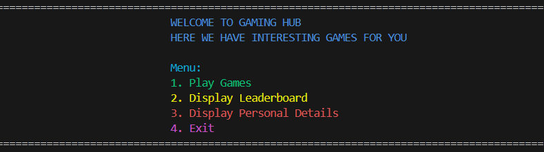

 <h1 align="center"> 🎮 Game Centre</h1>

Welcome to **Game Centre**, a fun and interactive platform developed in **C language**, where users can explore a variety of **text-based games**, track their **achievements**, and enjoy an engaging terminal-based gaming experience!

---

## 🧩 About the Project

The **Game Centre Management System** brings together multiple mini-games into a single console application.  
It’s designed for entertainment, simplicity, and hands-on experience with C programming fundamentals like loops, arrays, pointers, functions and file handling.

---

## 🚀 Key Features

### 1️⃣ User Registration and Login
Users can create accounts with a **username and password**, enabling personalized profiles.  
All login details are **securely stored**, ensuring privacy and allowing for easy access in future sessions.

---

### 2️⃣ Interactive and Color-Coded Main Menu
The program features a visually engaging, color-coded menu for easy navigation.
Options include starting a game, viewing the leaderboard, checking personal statistics, or exiting.



---

### 3️⃣ Enhanced Gameplay Features
- 💡 **Hint System** – Offers hints when requested.  
- ⏱️ **Timer** – Adds time-based challenges to certain games.  
- 🏅 **Badges** – Earn Bronze, Silver or Golden badges based on performance.  
- 📊 **Statistics** – Track wins, losses and other personal game data.

---

### 4️⃣ User Score Tracking and Achievements
- 🏆 High scores and win/loss records are stored persistently.
- 📈 A leaderboard ranks players based on their performance.
- 🎖️ Achievements and badges are displayed prominently for motivation

---

### 5️⃣ Game Instructions
Each game provides **clear instructions and rules** to ensure players understand the mechanics before starting.

---

## 🕹️ Games Included

| Game | Description |
|------|--------------|
| 🧩 **Tic-Tac-Toe** | Classic 3×3 grid game played against the computer. |
| 🔢 **Number Guessing Game** | Try to guess a randomly generated number. |
| ✂️ **Rock, Paper, Scissors** | Play the familiar hand game against the computer. |
| 🔠 **Hangman** | Guess letters to reveal a hidden word before running out of attempts. |
| 🧮 **Quiz Game** | Answer multiple-choice questions to earn points and test your knowledge. |

---

## 💻 How to Run

### 1. Clone the repository:
   ```bash
   git clone https://github.com/yourusername/Game-Centre.git
   cd Game-Centre
```

### 2. Compile the Program:
    gcc gamecentre.c -o gamecentre
    
### 3. Run the Program:
   ```bash
  ./gamecentre       # Mac / Linux
gamecentre.exe     # Windows
```
- The program will automatically create users.txt to save user profiles and game data.
- Follow the on-screen menu to play games, view leaderboard, or check personal details.
